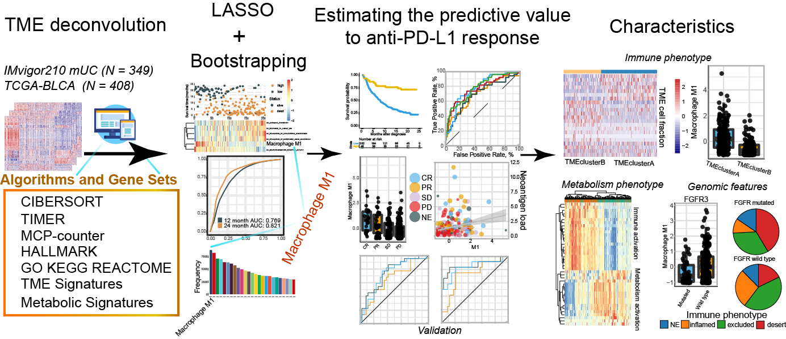

<!-- README.md is generated from README.Rmd. Please edit that file -->

```{r, include = FALSE}
knitr::opts_chunk$set(
  collapse = TRUE,
  comment = "#>",
  fig.path = "man/figures",
  out.width = "100%"
)
```

# Blasso： Integrating LASSO regression and bootstrapping algorithm to find best prognostic or predictive feature



The package is not yet on CRAN. You can install from Github:

```{r,message=FALSE}
if (!requireNamespace("devtools", quietly = TRUE)) 
  install.packages("devtools")
if (!requireNamespace("Blasso", quietly = TRUE)) 
  devtools::install_github("DongqiangZeng0808/Blasso")
```

Loading packages and main function in the package:
```{r, warning=FALSE,message=T}

library(Blasso) 
help("best_predictor_cox")
help("best_predictor_binomial")

```

Supplementary data

```{r}
data("target")
head(target)

data("features")
features[1:5,1:5]

```

## Usage-1: Cox-regression model

```{r,LassoCox,fig.height=8, fig.width= 10,message=FALSE,warning=FALSE}

res<-best_predictor_cox(target_data   = target, 
                        features      = features, 
                        status        = "status",
                        time          = "time",
                        nfolds        = 10,
                        permutation   = 300,
                        show_progress = FALSE)
head(res$res, n = 10)

```


## Usage-2: Binomial model

```{r,LassoBinomial, fig.height=8, fig.width= 10,message=FALSE,warning=FALSE}

res<-best_predictor_binomial(target_data   = target, 
                             features      = features,
                             response      = "status",
                             nfolds        = 10,
                             permutation   = 300,
                             show_progress = FALSE)
head(res$res, n = 10)

```

## Session Info

```{r,message=FALSE}
sessionInfo()
```


## References

Zeng D, Ye Z, Wu J, Zhou R, Fan X, Wang G, Huang Y, Wu J, Sun H, Wang M, Bin J, Liao Y, Li N, Shi M, Liao W. Macrophage correlates with immunophenotype and predicts anti-PD-L1 response of urothelial cancer. *Theranostics* 2020; 10(15):7002-7014. [doi:10.7150/thno.46176](http://www.thno.org/v10p7002.html)

---------
Contact:
E-mail any questions to dongqiangzeng0808@gmail.com
