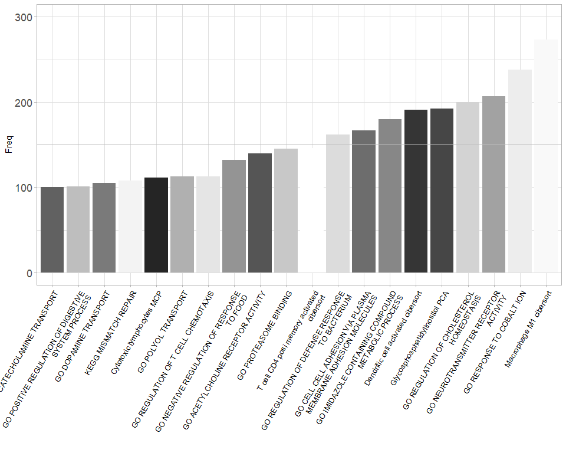
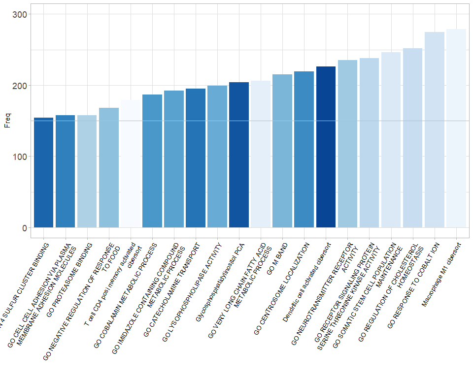

<!-- README.md is generated from README.Rmd. Please edit that file -->

# Blasso： Integrating LASSO regression and bootstrapping algorithm to find best prognostic or predictive feature

The package is not yet on CRAN. You can install from Github:

``` r
if (!requireNamespace("devtools", quietly = TRUE)) install.packages("devtools")
if (!requireNamespace("Blasso", quietly = TRUE))  devtools::install_github("DongqiangZeng0808/Blasso")
```

Loading packages and main function in the package:

``` r
library(Blasso) 
help("best_predictor_cox")
help("best_predictor_binomial")
```

Supplementary data

``` r
data("target")
head(target)
#>                ID status       time
#> 1 SAM00b9e5c52da9      1  1.9055441
#> 2 SAM0257bbbbd388      1 15.6386037
#> 3 SAM025b45c27e05      1  8.7720739
#> 4 SAM032c642382a7      1  2.4969199
#> 5 SAM04c589eb3fb3      0  0.6899384
#> 6 SAM0571f17f4045      1  4.5338809

data("features")
features[1:5,1:5]
#>                ID Glycosphosphatidylinositol_PCA Macrophage_M1_cibersort
#> 1 SAM00b9e5c52da9                     -0.3791156              -0.9651426
#> 2 SAM0257bbbbd388                      1.3471887              -0.8690076
#> 3 SAM025b45c27e05                     -0.1356366              -0.9915367
#> 4 SAM032c642382a7                     -1.5168052               0.8050212
#> 5 SAM04c589eb3fb3                     -3.0750685               0.6753930
#>   GO_CATECHOLAMINE_TRANSPORT GO_DOPAMINE_TRANSPORT
#> 1                -0.05571328            -0.2575771
#> 2                -0.27535773            -0.3974832
#> 3                 0.74345430             0.5631046
#> 4                -1.69420060            -1.4923073
#> 5                -1.58320438            -1.3433413
```

## Usage-1: Cox-regression model

``` r
res<-best_predictor_cox(target_data = target, 
                        features = features, 
                        status = "status",
                        time = "time",
                        nfolds = 10,
                        permutation = 300,
                        show_progress = FALSE)
```



``` r
head(res$res, n = 10)
#>                                                             res Freq
#> 1                                       Macrophage M1 cibersort  260
#> 2                                     GO RESPONSE TO COBALT ION  251
#> 3                         GO NEUROTRANSMITTER RECEPTOR ACTIVITY  215
#> 4            GO IMIDAZOLE CONTAINING COMPOUND METABOLIC PROCESS  200
#> 5                      GO REGULATION OF CHOLESTEROL HOMEOSTASIS  195
#> 6                            Dendritic cell activated cibersort  180
#> 7                                Glycosphosphatidylinositol PCA  177
#> 8  GO CELL CELL ADHESION VIA PLASMA MEMBRANE ADHESION MOLECULES  166
#> 9                    T cell CD4 posi memory activated cibersort  151
#> 10               GO REGULATION OF DEFENSE RESPONSE TO BACTERIUM  146
```

## Usage-2: Binomial model

``` r
res<-best_predictor_binomial(target_data = target, 
                             features = features,
                             response = "status",
                             nfolds = 10,
                             permutation = 300,
                             show_progress = FALSE)
```



``` r
head(res$res, n = 10)
#>                                                               res Freq
#> 2                                         Macrophage M1 cibersort  280
#> 3                                       GO RESPONSE TO COBALT ION  274
#> 4                           GO NEUROTRANSMITTER RECEPTOR ACTIVITY  247
#> 5                     GO SOMATIC STEM CELL POPULATION MAINTENANCE  244
#> 6                                                       GO M BAND  239
#> 7                              Dendritic cell activated cibersort  234
#> 8                        GO REGULATION OF CHOLESTEROL HOMEOSTASIS  233
#> 9                                      GO CENTROSOME LOCALIZATION  208
#> 10 GO RECEPTOR SIGNALING PROTEIN SERINE THREONINE KINASE ACTIVITY  207
#> 11                GO VERY LONG CHAIN FATTY ACID METABOLIC PROCESS  202
```

## Session Info

``` r
sessionInfo()
#> R version 4.0.4 (2021-02-15)
#> Platform: x86_64-w64-mingw32/x64 (64-bit)
#> Running under: Windows 10 x64 (build 19041)
#> 
#> Matrix products: default
#> 
#> locale:
#> [1] LC_COLLATE=Chinese (Simplified)_China.936 
#> [2] LC_CTYPE=Chinese (Simplified)_China.936   
#> [3] LC_MONETARY=Chinese (Simplified)_China.936
#> [4] LC_NUMERIC=C                              
#> [5] LC_TIME=Chinese (Simplified)_China.936    
#> 
#> attached base packages:
#> [1] stats     graphics  grDevices utils     datasets  methods   base     
#> 
#> other attached packages:
#> [1] Blasso_0.1.0       stringr_1.4.0      progress_1.2.2     RColorBrewer_1.1-2
#> [5] survival_3.2-10    tibble_3.1.0       ggplot2_3.3.3      glmnet_4.1-1      
#> [9] Matrix_1.3-2      
#> 
#> loaded via a namespace (and not attached):
#>  [1] lattice_0.20-41   prettyunits_1.1.1 ps_1.6.0          assertthat_0.2.1 
#>  [5] rprojroot_2.0.2   digest_0.6.27     foreach_1.5.1     utf8_1.2.1       
#>  [9] R6_2.5.0          evaluate_0.14     highr_0.8         pillar_1.5.1     
#> [13] rlang_0.4.10      callr_3.5.1       rmarkdown_2.7     desc_1.3.0       
#> [17] labeling_0.4.2    devtools_2.3.2    splines_4.0.4     munsell_0.5.0    
#> [21] compiler_4.0.4    xfun_0.22         pkgconfig_2.0.3   pkgbuild_1.2.0   
#> [25] shape_1.4.5       htmltools_0.5.1.1 tidyselect_1.1.0  codetools_0.2-18 
#> [29] fansi_0.4.2       crayon_1.4.1      dplyr_1.0.5       withr_2.4.1      
#> [33] grid_4.0.4        gtable_0.3.0      lifecycle_1.0.0   DBI_1.1.1        
#> [37] magrittr_2.0.1    scales_1.1.1      cli_2.4.0         stringi_1.5.3    
#> [41] cachem_1.0.4      farver_2.1.0      fs_1.5.0          remotes_2.3.0    
#> [45] testthat_3.0.2    ellipsis_0.3.1    vctrs_0.3.7       generics_0.1.0   
#> [49] iterators_1.0.13  tools_4.0.4       glue_1.4.2        purrr_0.3.4      
#> [53] hms_1.0.0         processx_3.4.5    pkgload_1.2.0     fastmap_1.1.0    
#> [57] yaml_2.2.1        colorspace_2.0-0  sessioninfo_1.1.1 memoise_2.0.0    
#> [61] knitr_1.31        usethis_2.0.1
```

## References

Zeng D, Ye Z, Wu J, Zhou R, Fan X, Wang G, Huang Y, Wu J, Sun H, Wang M,
Bin J, Liao Y, Li N, Shi M, Liao W. Macrophage correlates with
immunophenotype and predicts anti-PD-L1 response of urothelial cancer.
Theranostics 2020; 10(15):7002-7014.
[doi:10.7150/thno.46176](http://www.thno.org/v10p7002.html)

------------------------------------------------------------------------

Contact: E-mail any questions to <dongqiangzeng0808@gmail.com>
