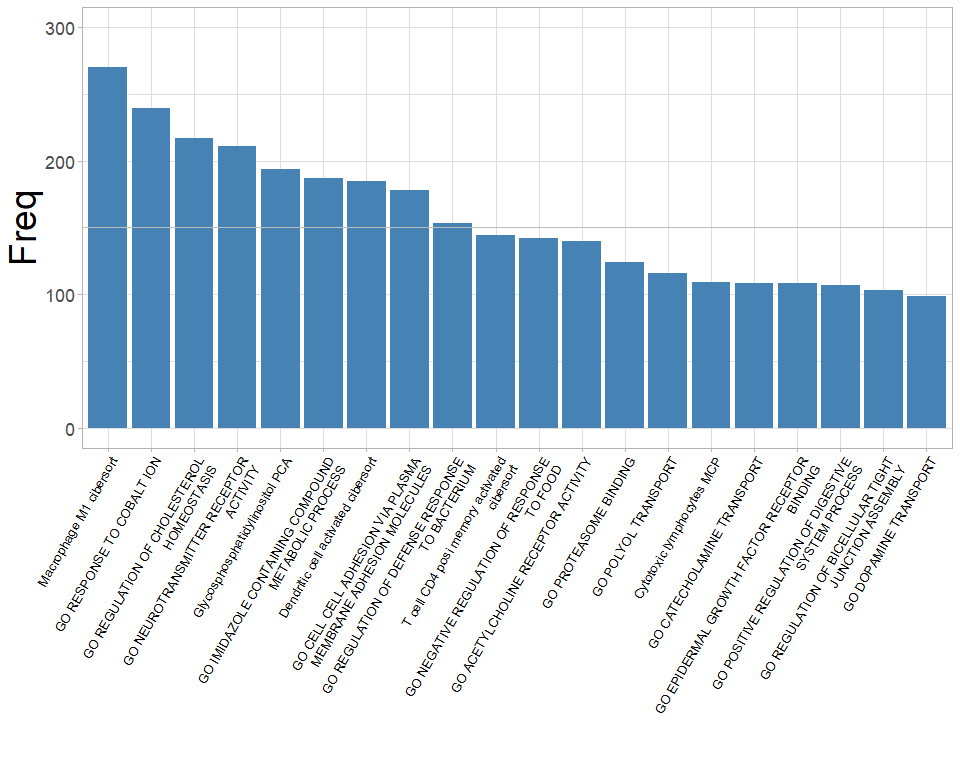
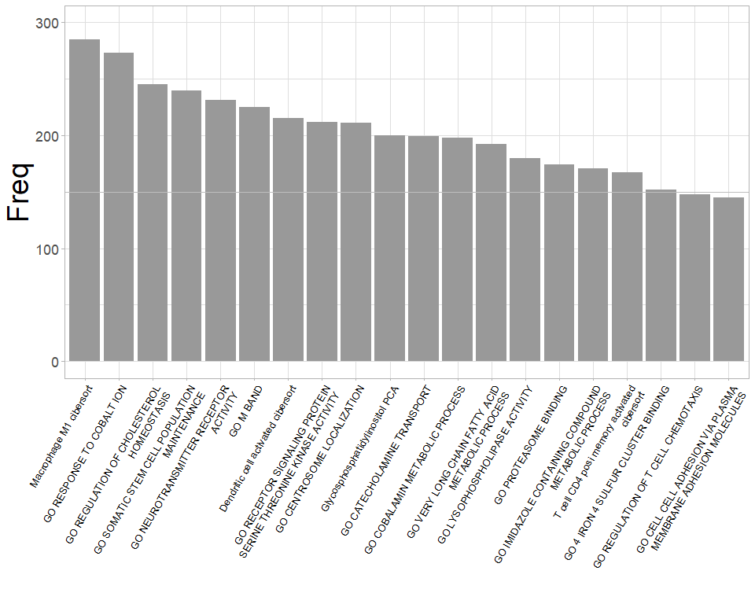

<!-- README.md is generated from README.Rmd. Please edit that file -->

# Blasso： Integrating LASSO regression and bootstrapping algorithm to find best prognostic or predictive feature

The package is not yet on CRAN. You can install from Github:

``` r

if (!requireNamespace("devtools", quietly = TRUE)) install.packages("devtools")
if (!requireNamespace("Blasso", quietly = TRUE))  devtools::install_github("DongqiangZeng0808/Blasso")
```

Loading packages and main function in the package:

``` r

library(Blasso) 
help("best_predictor_cox")
help("best_predictor_binomial")
```

Supplementary data

``` r
data("target")
head(target)
#>                ID status       time
#> 1 SAM00b9e5c52da9      1  1.9055441
#> 2 SAM0257bbbbd388      1 15.6386037
#> 3 SAM025b45c27e05      1  8.7720739
#> 4 SAM032c642382a7      1  2.4969199
#> 5 SAM04c589eb3fb3      0  0.6899384
#> 6 SAM0571f17f4045      1  4.5338809

data("features")
features[1:5,1:5]
#>                ID Glycosphosphatidylinositol_PCA Macrophage_M1_cibersort
#> 1 SAM00b9e5c52da9                     -0.3791156              -0.9651426
#> 2 SAM0257bbbbd388                      1.3471887              -0.8690076
#> 3 SAM025b45c27e05                     -0.1356366              -0.9915367
#> 4 SAM032c642382a7                     -1.5168052               0.8050212
#> 5 SAM04c589eb3fb3                     -3.0750685               0.6753930
#>   GO_CATECHOLAMINE_TRANSPORT GO_DOPAMINE_TRANSPORT
#> 1                -0.05571328            -0.2575771
#> 2                -0.27535773            -0.3974832
#> 3                 0.74345430             0.5631046
#> 4                -1.69420060            -1.4923073
#> 5                -1.58320438            -1.3433413
```

## Usage-1: Cox-regression model

``` r

res<-best_predictor_cox(target_data = target, 
                        features = features, 
                        status = "status",
                        time = "time",
                        nfolds = 10,
                        permutation = 300,
                        show_progress = FALSE,
                        palette = "Greys")
```



``` r
head(res$res, n = 10)
#>                                                             res Freq
#> 1                                       Macrophage M1 cibersort  273
#> 2                                     GO RESPONSE TO COBALT ION  238
#> 3                         GO NEUROTRANSMITTER RECEPTOR ACTIVITY  207
#> 4                      GO REGULATION OF CHOLESTEROL HOMEOSTASIS  200
#> 5                                Glycosphosphatidylinositol PCA  192
#> 6                            Dendritic cell activated cibersort  191
#> 7            GO IMIDAZOLE CONTAINING COMPOUND METABOLIC PROCESS  180
#> 8  GO CELL CELL ADHESION VIA PLASMA MEMBRANE ADHESION MOLECULES  167
#> 9                GO REGULATION OF DEFENSE RESPONSE TO BACTERIUM  162
#> 10                   T cell CD4 posi memory activated cibersort  146
```

## Usage-2: Binomial model

``` r

res<-best_predictor_binomial(target_data = target, 
                             features = features,
                             response = "status",
                             nfolds = 10,
                             permutation = 300,
                             show_progress = FALSE,
                             palette = "Blues")
```



``` r
head(res$res, n = 10)
#>                                                               res Freq
#> 2                                         Macrophage M1 cibersort  279
#> 3                                       GO RESPONSE TO COBALT ION  275
#> 4                        GO REGULATION OF CHOLESTEROL HOMEOSTASIS  252
#> 5                     GO SOMATIC STEM CELL POPULATION MAINTENANCE  246
#> 6  GO RECEPTOR SIGNALING PROTEIN SERINE THREONINE KINASE ACTIVITY  238
#> 7                           GO NEUROTRANSMITTER RECEPTOR ACTIVITY  235
#> 8                              Dendritic cell activated cibersort  226
#> 9                                      GO CENTROSOME LOCALIZATION  219
#> 10                                                      GO M BAND  215
#> 11                GO VERY LONG CHAIN FATTY ACID METABOLIC PROCESS  206
```

## Session Info

``` r
sessionInfo()
#> R version 3.6.3 (2020-02-29)
#> Platform: x86_64-w64-mingw32/x64 (64-bit)
#> Running under: Windows 10 x64 (build 19041)
#> 
#> Matrix products: default
#> 
#> locale:
#> [1] LC_COLLATE=Chinese (Simplified)_China.936 
#> [2] LC_CTYPE=Chinese (Simplified)_China.936   
#> [3] LC_MONETARY=Chinese (Simplified)_China.936
#> [4] LC_NUMERIC=C                              
#> [5] LC_TIME=Chinese (Simplified)_China.936    
#> 
#> attached base packages:
#> [1] stats     graphics  grDevices utils     datasets  methods   base     
#> 
#> other attached packages:
#> [1] Blasso_0.1.0       stringr_1.4.0      progress_1.2.2     RColorBrewer_1.1-2
#> [5] survival_3.2-3     tibble_3.0.3       ggplot2_3.3.3      glmnet_4.0-2      
#> [9] Matrix_1.2-18     
#> 
#> loaded via a namespace (and not attached):
#>  [1] shape_1.4.5       tidyselect_1.1.0  xfun_0.16         remotes_2.2.0    
#>  [5] purrr_0.3.4       splines_3.6.3     lattice_0.20-41   generics_0.1.0   
#>  [9] colorspace_1.4-1  vctrs_0.3.2       testthat_2.3.2    usethis_2.0.0    
#> [13] htmltools_0.5.0   yaml_2.2.1        rlang_0.4.8       pkgbuild_1.2.0   
#> [17] pillar_1.4.7      glue_1.4.2        withr_2.3.0       sessioninfo_1.1.1
#> [21] foreach_1.5.1     lifecycle_0.2.0   munsell_0.5.0     gtable_0.3.0     
#> [25] devtools_2.3.2    codetools_0.2-18  memoise_1.1.0     evaluate_0.14    
#> [29] labeling_0.4.2    knitr_1.30        callr_3.5.1       ps_1.5.0         
#> [33] fansi_0.4.1       scales_1.1.1      desc_1.2.0        pkgload_1.1.0    
#> [37] farver_2.0.3      fs_1.4.2          hms_0.5.3         digest_0.6.25    
#> [41] stringi_1.5.3     processx_3.4.5    dplyr_1.0.2       grid_3.6.3       
#> [45] rprojroot_2.0.2   cli_2.2.0         tools_3.6.3       magrittr_2.0.1   
#> [49] crayon_1.3.4      pkgconfig_2.0.3   ellipsis_0.3.1    prettyunits_1.1.1
#> [53] assertthat_0.2.1  rmarkdown_2.6     iterators_1.0.13  R6_2.5.0         
#> [57] compiler_3.6.3
```

## References

Zeng D, Ye Z, Wu J, Zhou R, Fan X, Wang G, Huang Y, Wu J, Sun H, Wang M,
Bin J, Liao Y, Li N, Shi M, Liao W. Macrophage correlates with
immunophenotype and predicts anti-PD-L1 response of urothelial cancer.
Theranostics 2020; 10(15):7002-7014.
[doi:10.7150/thno.46176](http://www.thno.org/v10p7002.html)

-----

Contact: E-mail any questions to <dongqiangzeng0808@gmail.com>
